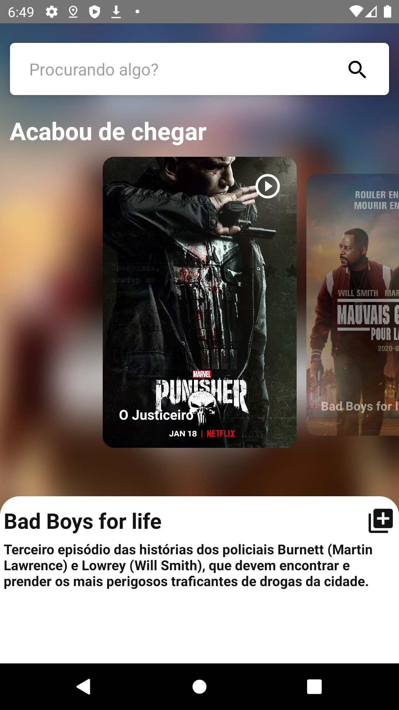
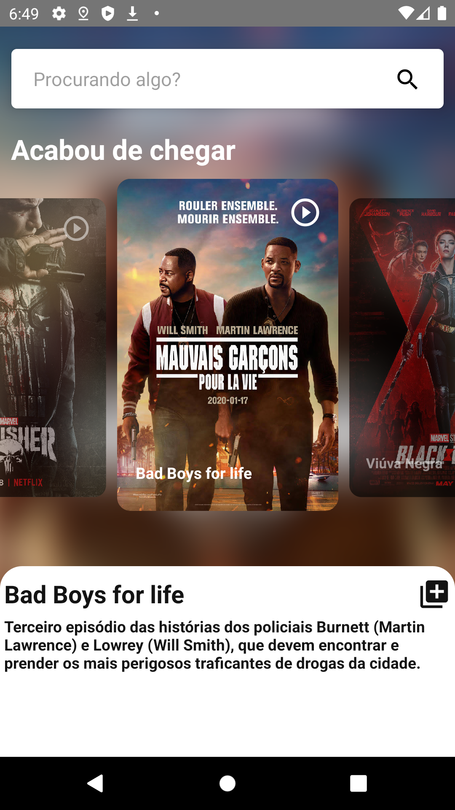
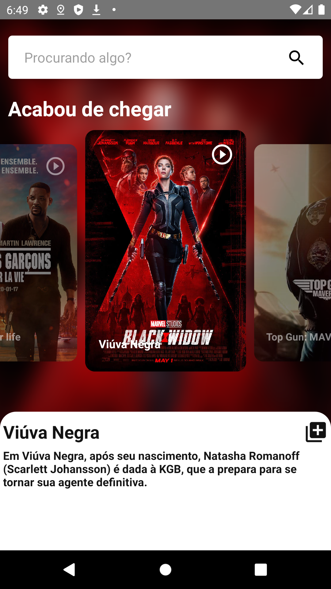
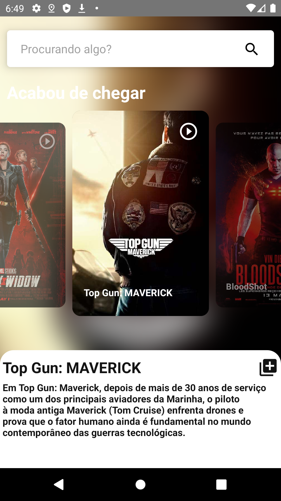
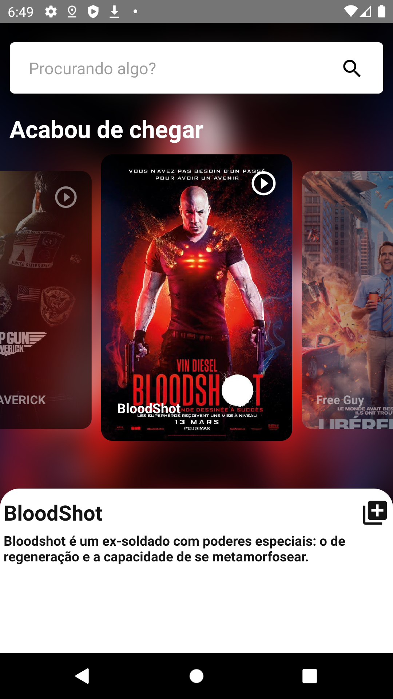
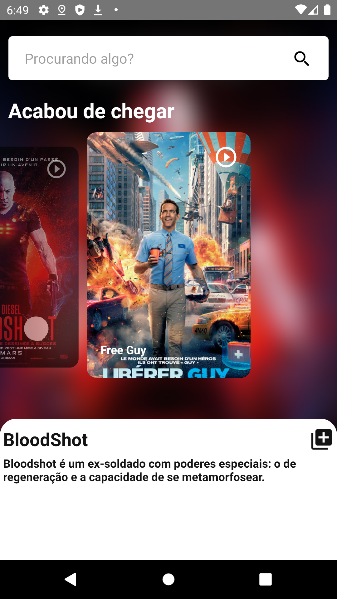

# app-filmes
Projeto criado em React Native com um protótipo de um aplicativo que realiza a busca de filmes.

### Bibliotecas utilizadas
• react-native-snap-carousel

• react-native-vector-icons

### Para testar

### mobile
react-native run-android

### screenshots

